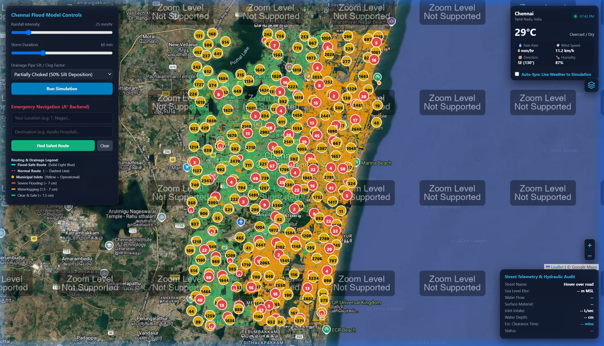
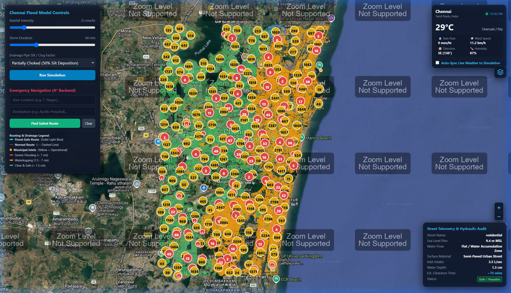
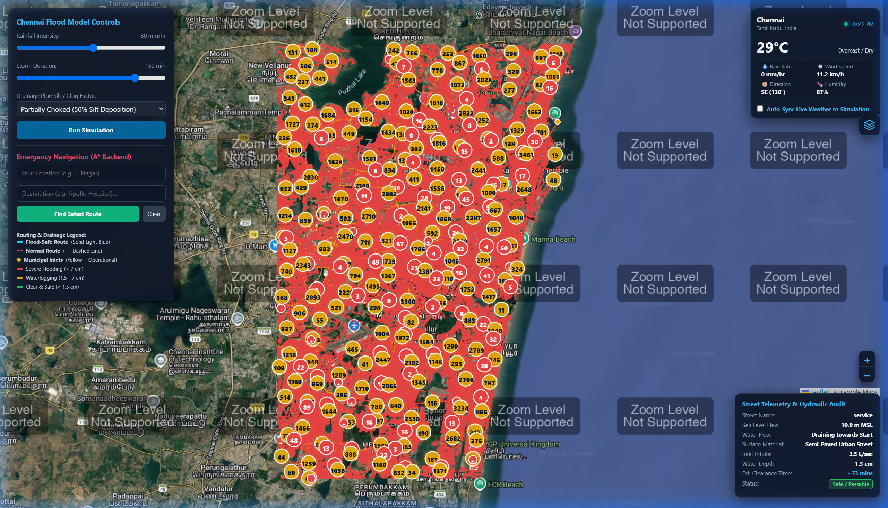
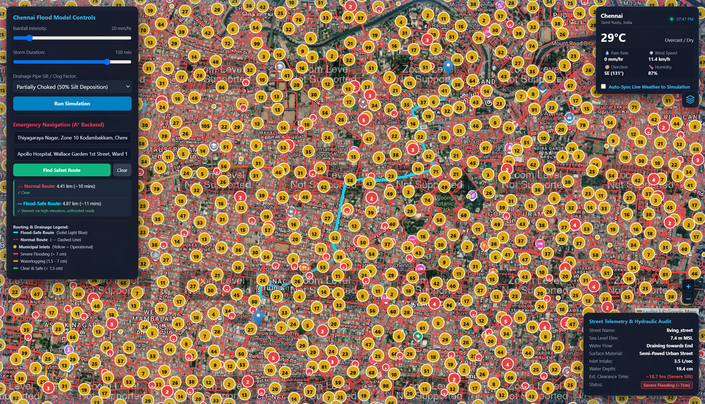
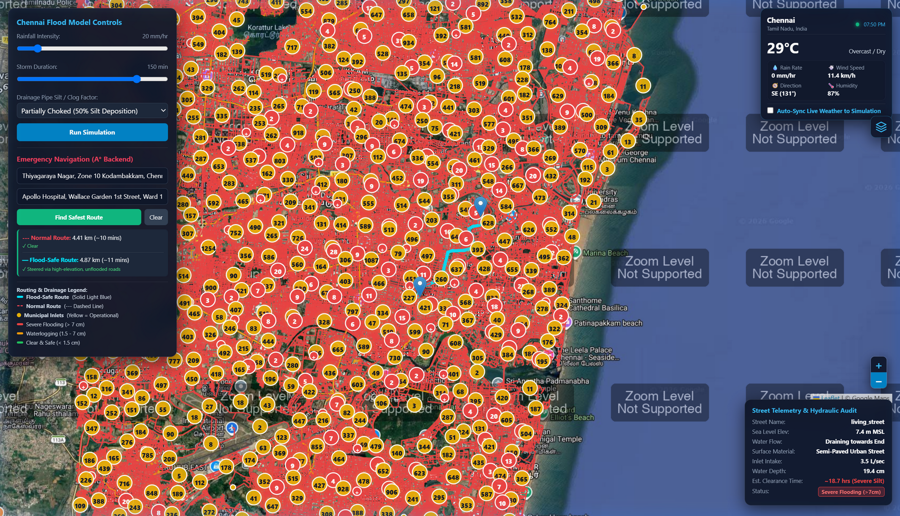
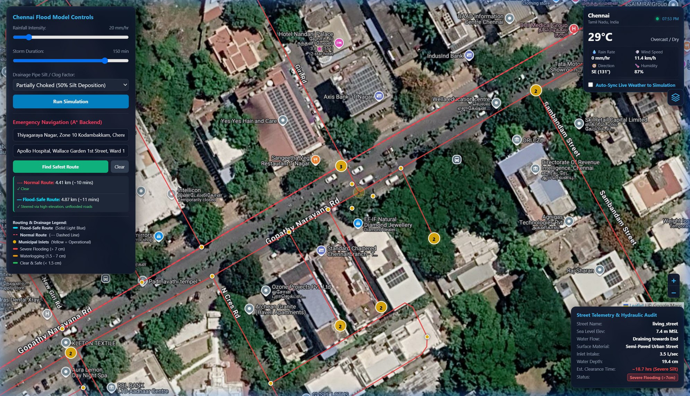

<div align="center">

# 🌊 Chennai Flood Early Warning & AI Safe Navigation System

**An intelligent real-time hydrological simulation and dynamic emergency routing engine for Chennai's urban flood resilience.**

[](https://python.org)
[](https://fastapi.tiangolo.com)
[](https://leafletjs.com)
[](https://docker.com)
[](https://cloud.google.com/run)

> Integrates **Digital Elevation Models**, **live precipitation telemetry**, and **dynamic graph-weight penalization** to compute safe transit corridors for emergency response vehicles and citizens during severe monsoonal events.

</div>

---

## 📸 Key Features & Visual Walkthrough

### 1. 🗺️ Interactive Flood Severity Heatmap & Elevation Grid

Dynamic visualization of Chennai's **74,000+ road network segments** categorized by real-time waterlogging depths using a three-tier color coding system:

| Color | Meaning | Depth Threshold |
|-------|---------|----------------|
| 🟢 Green | Safe / Passable | < 1.5 cm |
| 🟠 Orange | Waterlogged (Caution) | 1.5 – 7.0 cm |
| 🔴 Red | Severe Flooding | > 7.0 cm |



- Satellite and Street Map dual basemap toggle
- Hover over any road segment to see live telemetry (elevation MSL, depth, drain rate, clearance time)
- RainViewer Doppler radar overlay for real precipitation visualization
- Smooth canvas-rendering via Leaflet `preferCanvas` for 74K+ features

---

### 2. 🌡️ Real-Time Meteorological Synchronization

Live automated weather ingestion via **Open-Meteo API** capturing current Chennai conditions:



**Weather Telemetry Dashboard displays:**
- 🌡️ Temperature (°C)
- 🌧️ Rainfall intensity (mm/hr)
- 💨 Wind speed & direction (km/h + compass bearing)
- 💧 Relative humidity (%)
- 🕐 Last sync timestamp
- Auto-refresh every **3 minutes**
- **Live Sync Toggle** — instantly applies real Chennai rainfall rate to the simulation sliders

> **Fallback Mode:** If the API is unreachable, the system uses realistic Chennai monsoon defaults (28°C, 12.4 mm/hr rain, 87% humidity) so the app always functions.

---

### 3. 🌊 Dynamic Hydrological Flood Simulation

Interactive simulation controls powered by a **physical rate-balance hydrology model** specific to Chennai's urban drainage infrastructure:



**Three simulation parameters:**

| Parameter | Range | Effect |
|-----------|-------|--------|
| Rain Intensity | 5 – 150 mm/hr | Controls rainfall inflow rate per road catchment |
| Storm Duration | 10 – 360 min | Accumulates total excess water volume |
| Drainage Factor | 0.1 – 1.0 | Models silt-choked (0.1) to pristine (1.0) drains |

**Physics Engine (`hydraulics.py`):**
- Computes `Rain Rate (L/sec)` vs `Drain Intake (L/sec)` for each road segment
- Pipe diameter tiers: 350mm → 6 L/sec, 600mm → 12 L/sec, 900mm → 20 L/sec, 1200mm+ → 32 L/sec
- **Gravity multiplier** based on elevation MSL: Low < 3.5m (×0.40), Mid 3.5–6.5m (×0.75), High > 6.5m (×1.15)
- Coastal **tidal backwater effect** modeled for low-elevation areas (Velachery, Pallikaranai, Vyasarpadi)
- **Depressional pooling factor**: `1.0 + (1.8 / elevation^0.65)` captures natural bowl accumulation

---

### 4. 🚑 A\* Safe Navigation vs. Shortest Path Routing

Heuristic pathfinding engine demonstrating both standard shortest routes and dynamically rerouted flood-safe corridors:



**Dual-Route System:**
- **🔴 Dashed Coral Line** — Normal A\* shortest path (ignores flooding, often cuts through inundated zones)
- **🔵 Solid Cyan Line** — Flood-Safe A\* path (dynamically weighted to avoid flooded roads)

**Routing Algorithm (`router.py`):**
- Built on **NetworkX** graph with haversine distance weights
- Dynamic edge weight penalization:
  - Depth > 7 cm → `penalty = 10,000×` (strict block)
  - Depth 1.5–7 cm → `penalty = 1 + (depth × 2.5)` (exponential resistance)
  - Depth < 1.5 cm → `penalty = 1.0` (no resistance)
- **Nominatim autocomplete** location search for any Chennai locality
- Route summary shows: distance (km), estimated time (min), flooded segment count
- Hospital popup → "Set Destination" button for instant emergency navigation

---

### 5. 🏥 Critical Healthcare Facility Proximity

Geospatial overlay of **1,200+ hospitals and emergency triage centers** across Chennai:



- Red `+` cluster markers group nearby facilities for clean rendering at any zoom level
- Click any hospital cluster → expand to individual facilities
- Click a hospital popup → **"Set Destination"** button directly computes flood-safe evacuation route
- Supports Hospitals, Clinics, Trauma Centers, and Emergency Medical Centers
- Data sourced from **OpenStreetMap Chennai healthcare layer**

---

### 6. 🕳️ Municipal Drainage & Manhole Asset Management

Crowdsourced citizen reporting interface and municipal console for drainage incident management:



**Two-State Marker System:**
- 🟡 **Yellow marker** = Operational / Clean manhole chamber
- ⚫ **Black marker** = Reported / Choked / BLOCKED (alert sent to GCC)

**Citizen Reporting Workflow:**
1. Click any yellow manhole marker on the map
2. Incident card appears showing: Manhole ID, Street, Elevation MSL, Current Flood Depth
3. Enter blockage description (e.g., "Choked with plastic waste & silt")
4. Optionally attach a photo (base64 encoded & stored)
5. Submit → **Priority alert sent to Greater Chennai Corporation (GCC)**
6. Marker instantly turns Black on all connected clients

**Municipal Resolution Workflow:**
- GCC console clicks blocked (black) manhole → Views incident notes & photo proof
- Clicks "Mark Resolved" → Blockage cleared, marker returns to Yellow

---

## 🛠️ Architecture & Tech Stack

```
┌─────────────────────────────────────────────────────────┐
│                    FRONTEND (Browser)                    │
│  Leaflet.js + OpenStreetMap + Vanilla JS / CSS3         │
│  ├── Road GeoJSON renderer (74K+ segments, canvas)      │
│  ├── Hospital cluster layer (Leaflet.MarkerCluster)     │
│  ├── Manhole incident layer (yellow/black divIcons)     │
│  ├── A* dual-route polyline visualization               │
│  ├── Live weather dashboard (Open-Meteo polling)        │
│  └── RainViewer Doppler radar tile layer                │
└──────────────────────┬──────────────────────────────────┘
                       │ REST API (JSON)
┌──────────────────────▼──────────────────────────────────┐
│                  BACKEND (FastAPI + Uvicorn)             │
│  ├── /api/roads         → GeoJSON road network          │
│  ├── /api/hospitals     → Healthcare facilities GeoJSON │
│  ├── /api/live-weather  → Open-Meteo weather proxy      │
│  ├── /api/simulate      → Hydraulic depth engine        │
│  ├── /api/route         → NetworkX A* dual routing      │
│  ├── /api/manholes      → Drainage asset GeoJSON        │
│  ├── /api/manhole/report → Blockage reporting           │
│  └── /api/manhole/resolve → Incident resolution         │
└──────────────────────┬──────────────────────────────────┘
                       │
┌──────────────────────▼──────────────────────────────────┐
│                    DATA LAYER                            │
│  ├── chennai_roads_elevated.geojson (39 MB, 74K roads)  │
│  ├── chennai_hospitals.geojson (1,200+ facilities)      │
│  └── manhole_incidents.json (persistent incident log)   │
└─────────────────────────────────────────────────────────┘
```

| Layer | Technology |
|-------|-----------|
| **Backend Engine** | Python 3.11, FastAPI, Uvicorn |
| **Spatial Graph Routing** | NetworkX (A\* with dynamic edge weighting) |
| **Hydrology Model** | Custom rate-balance physics engine |
| **Frontend Map** | Leaflet.js, OpenStreetMap tiles, Google Satellite |
| **Weather API** | Open-Meteo (free, no API key required) |
| **Radar Overlay** | RainViewer public API |
| **Location Search** | Nominatim OpenStreetMap geocoder |
| **Deployment** | Docker, Google Cloud Run, Render |

---

## 🔌 API Endpoints Reference

| Method | Endpoint | Description |
|--------|----------|-------------|
| `GET` | `/api/roads` | Fetches elevated road network GeoJSON (74K features) |
| `GET` | `/api/hospitals` | Retrieves emergency medical centers spatial data |
| `GET` | `/api/live-weather` | Streams real-time Chennai weather telemetry |
| `POST` | `/api/simulate` | Computes road-by-road flood depth based on rain parameters |
| `POST` | `/api/route` | Computes standard vs. flood-penalized A\* evacuation paths |
| `GET` | `/api/manholes` | Fetches municipal drainage nodes & blockage status |
| `POST` | `/api/manhole/report` | Submits a clogged drainage incident |
| `POST` | `/api/manhole/resolve` | Marks a reported drainage incident as cleared |

### Example: Flood Simulation Request
```bash
curl -X POST http://localhost:8001/api/simulate \
  -H "Content-Type: application/json" \
  -d '{"rain_intensity": 80, "duration_min": 120, "drain_factor": 0.3}'
```

### Example: Safe Route Request
```bash
curl -X POST http://localhost:8001/api/route \
  -H "Content-Type: application/json" \
  -d '{
    "start_lat": 13.0418, "start_lon": 80.2341,
    "end_lat": 13.0674, "end_lon": 80.2376,
    "rain_intensity": 60, "duration_min": 90, "drain_factor": 0.5
  }'
```

---

## ⚡ Local Setup & Execution

### Prerequisites
- Python 3.10 or higher
- Git

### Installation

```bash
# Clone the repository
git clone https://github.com/bravo0001/chennai-flood-ops.git
cd chennai-flood-ops

# Create and activate virtual environment
python -m venv .venv

# On Windows:
.\.venv\Scripts\activate
# On Linux/macOS:
source .venv/bin/activate

# Install dependencies
pip install -r requirements.txt
```

### Run the Application

```bash
# Run on port 8001
python app.py

# OR use uvicorn directly with auto-reload
uvicorn app:app --host 127.0.0.1 --port 8001 --reload
```

Open your browser at **http://127.0.0.1:8001**

---

## 🐳 Docker Deployment

```bash
# Build the Docker image
docker build -t chennai-flood-ops .

# Run the container
docker run -p 8001:8000 chennai-flood-ops
```

---

## ☁️ Cloud Run Deployment (Google Cloud)

```bash
# Build and push to Google Container Registry
gcloud builds submit --tag gcr.io/YOUR_PROJECT/chennai-flood-ops

# Deploy to Cloud Run
gcloud run deploy chennai-flood-ops \
  --image gcr.io/YOUR_PROJECT/chennai-flood-ops \
  --platform managed \
  --region asia-south1 \
  --allow-unauthenticated
```

---

## 📁 Project Structure

```
chennai-flood-ops/
├── app.py                          # FastAPI application & all API endpoints
├── hydraulics.py                   # Physical hydrology depth calculation engine
├── router.py                       # NetworkX A* flood-aware routing engine
├── drainage_manager.py             # Manhole/drainage asset CRUD manager
├── chennai_roads_elevated.geojson  # 39MB road network with elevation metadata
├── chennai_hospitals.geojson       # 1,200+ healthcare facility locations
├── manhole_incidents.json          # Persistent drainage incident log
├── requirements.txt                # Python dependencies
├── Dockerfile                      # Container definition
├── render.yaml                     # Render.com deployment config
├── .github/
│   └── workflows/
│       └── deploy.yml              # GitHub Actions CI/CD pipeline
├── static/
│   ├── index.html                  # Single-page application shell
│   ├── main.js                     # Leaflet map, simulation & routing logic
│   └── style.css                   # Dark-theme UI styles
└── screenshots/
    ├── 01_flood_map_overview.png
    ├── 02_live_weather_sync.png
    ├── 03_hydrology_simulation.png
    ├── 04_astar_routing_comparison.png
    ├── 05_hospital_network.png
    └── 06_manhole_reporting.png
```

---

## 🔬 Hydrology Model — How It Works

The simulation computes water depth for every road segment using this physical model:

```
Rain Inflow Rate (L/sec) = (rain_intensity / 3600) × catchment_area × runoff_coefficient

Drain Capacity (L/sec)   = base_pipe_capacity × drain_factor × gravity_multiplier

Net Surplus (L/sec)      = max(0, Inflow - Drain_Capacity)

Total Excess (L)         = Net_Surplus × storm_duration_seconds

Pooling Effect           = Total_Excess × (1 + 1.8 / elevation^0.65)

Water Depth (cm)         = (Pooling_Effect / catchment_area) × 0.1
```

**Key Chennai-specific calibrations:**
- Coastal tidal locking for areas < 3.5m MSL (40% drain efficiency reduction)
- Depressional bowl accumulation for Velachery, Pallikaranai, Vyasarpadi basins
- Per-segment pipe diameter metadata from Greater Chennai Corporation records

---

## 🧭 A\* Routing Algorithm — How It Works

```python
# Normal Route: Standard A* on geographic distance
normal_path = nx.astar_path(graph, start, end, weight="distance")

# Flood-Safe Route: A* with flood-penalized edge weights
# penalty = 10,000x for depth > 7cm, exponential for 1.5-7cm
flood_path = nx.astar_path(graph, start, end, weight="weight")
```

The router builds a connected graph of ~200K+ nodes from road segment endpoints, then uses haversine distance as both the edge weight and A\* heuristic for geographically optimal paths.

---

## 🌐 Data Sources

| Dataset | Source | Details |
|---------|--------|---------|
| Chennai Road Network | OpenStreetMap | 74,000+ road segments with highway classification |
| Elevation Data | OpenStreetMap + SRTM | MSL elevation per road segment (meters) |
| Drainage Metadata | Greater Chennai Corporation | Pipe diameter, flow direction, runoff coefficients |
| Hospital Locations | OpenStreetMap Healthcare | 1,200+ verified medical facilities |
| Live Weather | [Open-Meteo API](https://open-meteo.com) | Free, no API key, Chennai coordinates |
| Radar Imagery | [RainViewer API](https://rainviewer.com/api.html) | Public weather radar tiles |

---

## 📄 License

This project is licensed under the **MIT License** — see the [LICENSE](LICENSE) file for details.

---

## 🙏 Acknowledgements

- **Open-Meteo** for free weather API access
- **OpenStreetMap contributors** for Chennai geographic data
- **RainViewer** for public Doppler radar tiles
- **Greater Chennai Corporation (GCC)** for infrastructure reference data
- **NetworkX** for robust graph algorithms in Python

---

<div align="center">

**Built with ❤️ for Chennai's flood resilience**

*Chennai Flood Operations — Protecting Lives Through Intelligent Technology*

</div>
